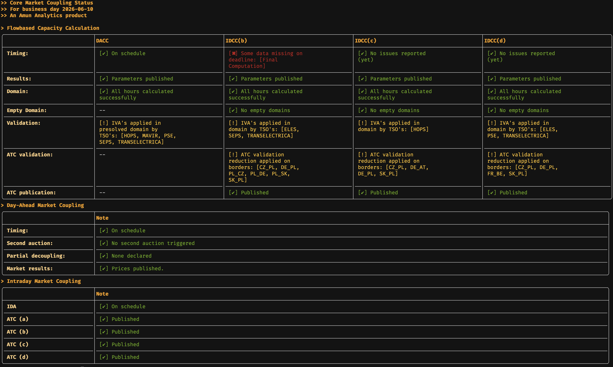

# Core Flowbased Status CLI
Create and supported by [Amun Analytics](https://amunanalytics.eu/)  
This is a terminal tool to interact and display the [Core Flowbased status page](https://status.coreflowbased.eu/).
It is provided for Windows, Mac (both intel and silicon) and Linux.
You can display the data in a friendly way in your terminal for each businessday you want. It autoscales the widths and colors the cells depending on the status.

Please note that if you want to get the data in your own application you can use the API with curl by appending /json or /xml to the status page url. 
This tool is meant for a viewing purpose in your terminal.

## Installation
Either download the latest version from the [releases page](https://github.com/AmunAnalytics/flowbased-status-cli/releases) 
or use one of the following package managers:

### Brew
When install for the first time install the AmunAnalytics Tools tap first: ```brew tap amunanalytics/tools```  
Then install the tool with ```brew install --cask fbstatus```

### Arch Linux
There is an [AUR package](https://aur.archlinux.org/packages/fbstatus-cli) available. 
Either install through downloading the PKGBUILD manually or use an AUR wrapper for example ```yay -S fbstatus-cli```

## Usage
There are the following ways to use the tool:
```fbstatus version``` -> this prints the current version and git hash of the tool  
```fbstatus``` -> prompts the user for a business day and display the full status table  
```fbstatus <businessday>``` -> displays the full status page directly of the specified businessday.  
```fbstatus short``` -> prompts the user for a business day and shows a short table with trafic lights  
```fbstatus short <businessday>``` -> displays the short table directly for the specified businessday  

Any business day input should have the format ```YYYY-MM-DD``` or use the following shorthands:
* "today" or "D" for business day today
* "tomorrow" or "D+1" for business day tomorrow 

This is only possible if you supply it as a direct commandline argument

## Screenshot


## Short Table Definition
The short table uses the following abbreviations:
* R -> Results
* D -> Domain
* ED -> Empty Domain
* V -> Validation
* R B -> Returned Branches
* A V -> ATC Validation
* A -> ATC

## Telemetry
This tool gathers some telemetry data and sends it to my server, namely your OS architecture and how often you use the tool. 
If you whish to disable this set the environment variable ```AMUN_DISABLE_TELEMETRY="1"``` or see the config section below

## Config
This tool has some configuration options. You can either set the appropriate environment variables to "1" or write in ```~/.amun-analytics/config.toml```.    
See below an example config with the matching environment variables:
```toml
[General]
disable_telemetry = false # AMUN_DISABLE_TELEMETRY

[fbstatus]
surpress_version_check = false # AMUN_SURPRESS_VERSION_CHECK
```

You can run ```fbstatus config``` to see all loaded configuration options